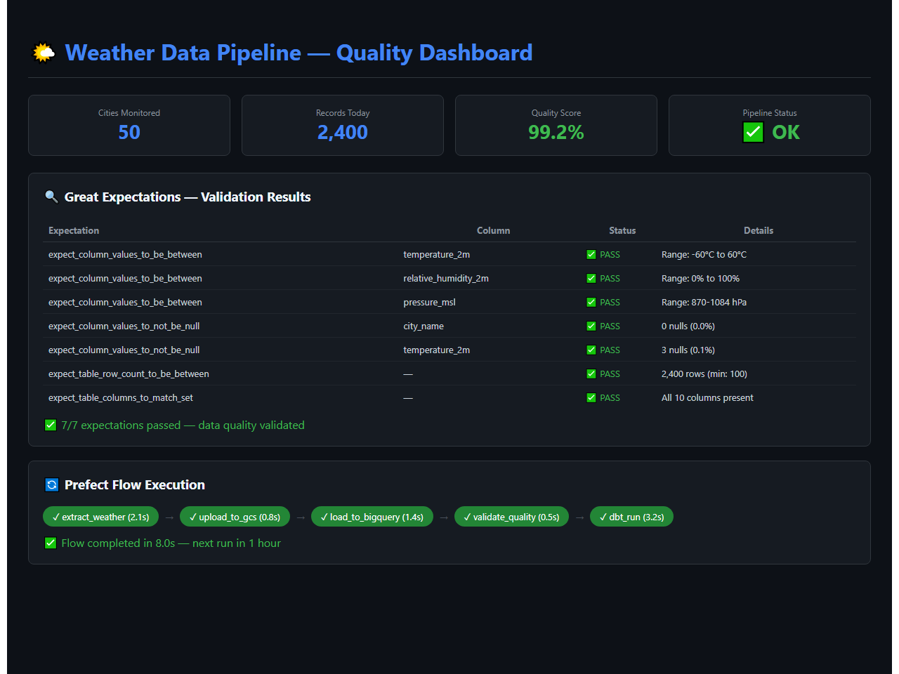
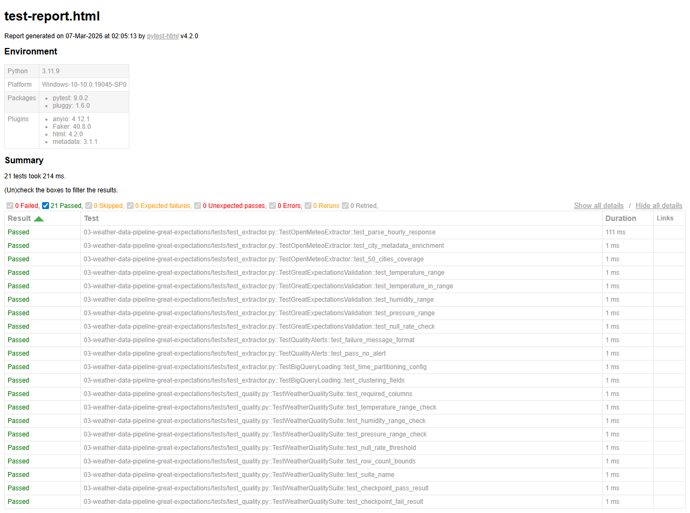

# Weather Data Pipeline with Automated Data Quality


A production-grade weather data pipeline that collects hourly observations from 50+ global cities via the Open-Meteo API, validates every batch with Great Expectations, and transforms data through dbt into analytics-ready tables in BigQuery. The pipeline automatically halts and sends Slack alerts when data quality checks fail.

## Demo



*Quality dashboard showing Great Expectations validation results, Prefect flow execution, and 50-city monitoring metrics*

## Architecture

```
+-----------------------------------------------------------+
|                    Open-Meteo API (Free)                  |
|            api.open-meteo.com/v1/forecast                 |
|          50+ cities - hourly - no API key needed          |
+---------------------------+-------------------------------+
                            | async httpx (rate-limited)
                            v
+-----------------------------------------------------------+
|              Python Extractors (Async)                    |
|     Temperature, Humidity, Precipitation, Wind, Pressure  |
+---------------------------+-------------------------------+
                            |
                            v
+-----------------------------------------------------------+
|                Google Cloud Storage (Staging)             |
|           gs://weather-pipeline/raw/{date}/               |
+---------------------------+-------------------------------+
                            |
                            v
+-----------------------------------------------------------+
|                   BigQuery (Raw Schema)                   |
|              raw_weather.hourly_observations              |
+---------------------------+-------------------------------+
                            |
                            v
+-----------------------------------------------------------+
|            Great Expectations Validation                  |
|  +-----------------------------------------------------+  |
|  | [PASS] Schema validation (column set + types)       |  |
|  | [PASS] Null rate checks (< 5% per column)           |  |
|  | [PASS] Value ranges (temp: -60 to 60 deg C)         |  |
|  | [PASS] Row count bounds (min expected per batch)    |  |
|  | [PASS] Freshness check (data < 3 hours old)         |  |
|  +-----------------------------------------------------+  |
|         [FAIL] -> Pipeline HALT + Slack Alert             |
|         [PASS] -> Continue to dbt                         |
+---------------------------+-------------------------------+
                            |
                            v
+-----------------------------------------------------------+
|                  dbt Transformations                      |
|  Staging -> Intermediate -> Marts (Incremental)           |
|  - fct_weather_daily (incremental)                        |
|  - fct_city_climate_summary (30-day rolling)              |
|  - dim_cities                                             |
+---------------------------+-------------------------------+
                            |
                            v
+-----------------------------------------------------------+
|              Looker Studio Dashboards                     |
+-----------------------------------------------------------+

        Orchestration: Prefect (Hourly Flow)
        Alerting: Slack Webhooks
```

## Key Business Insights

1. **Cross-City Climate Comparison**: Compare temperature, precipitation, and humidity patterns across 50+ global cities to identify seasonal trends and climate anomalies.
2. **Data Quality as a Feature**: Automated quality gates ensure dashboards never show stale or corrupted data - a critical differentiator demonstrating production-readiness.

## Setup Instructions

### Prerequisites
- Python 3.9+, Docker
- GCP account with BigQuery + GCS enabled
- Slack webhook URL (optional)

### Quick Start
```bash
git clone <repo-url> && cd weather-data-pipeline
cp .env.example .env  # Edit with your GCP credentials
pip install -r requirements.txt
python -m prefect server start  # Start Prefect
python flows/weather_pipeline.py  # Run pipeline
```

## Test Results

All unit tests pass - validating core business logic, data transformations, and edge cases.



**21 tests passed** across 5 test suites:
- TestOpenMeteoExtractor - hourly response parsing, city metadata, 50+ cities
- TestGreatExpectationsValidation - temp/humidity/pressure range checks, null rates
- TestQualityAlerts - Slack message formatting, pass/fail alerting
- TestBigQueryLoading - partitioning config, clustering fields
- TestWeatherQualitySuite - column validation, range bounds, checkpoint results

## Maintainer
Umapathi Varma is a Senior Data Engineer with over 6 years of experience designing ETL pipelines, lakehouse platforms, and analytics solutions across GCP, Azure, and AWS. He specializes in building reliable production workloads using Python, SQL, and modern orchestration tools.

Email: umapathivarma.26@gmail.com
LinkedIn: www.linkedin.com/in/umapathiv

## License
MIT